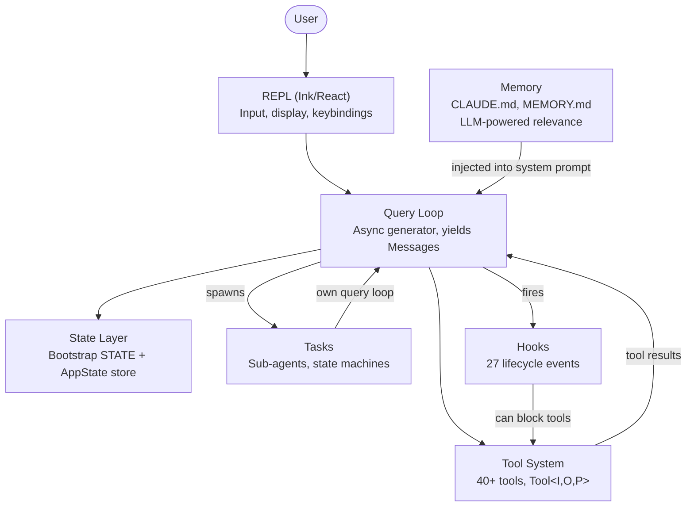
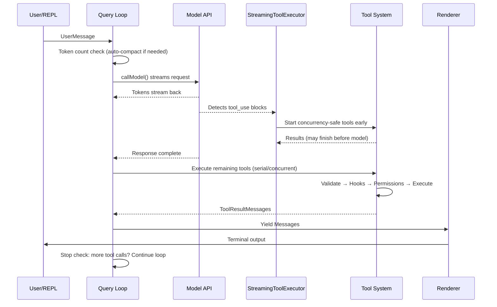
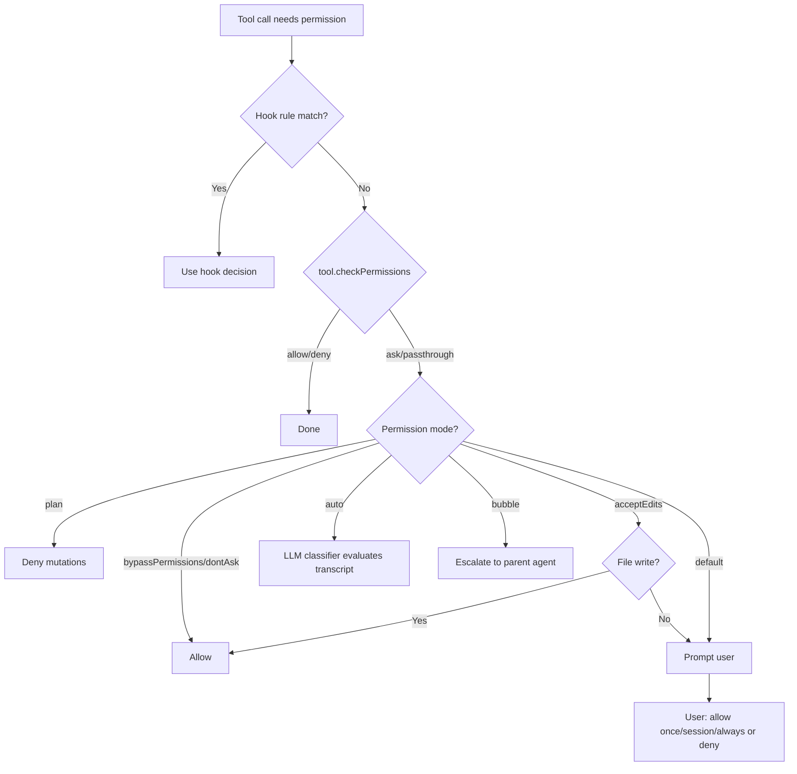
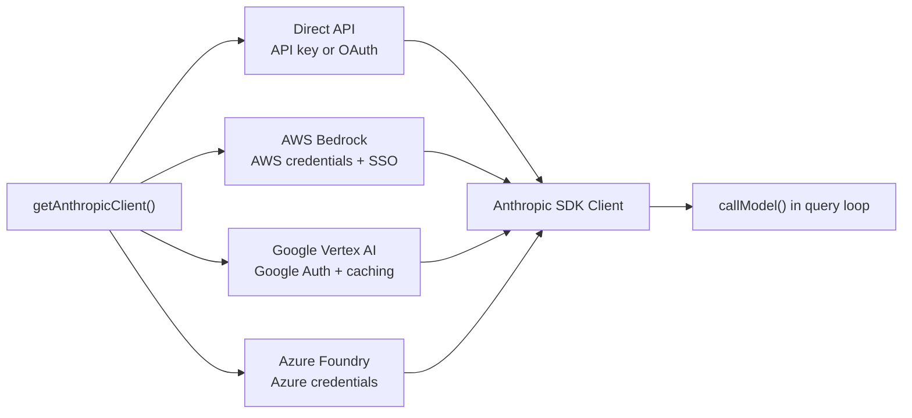
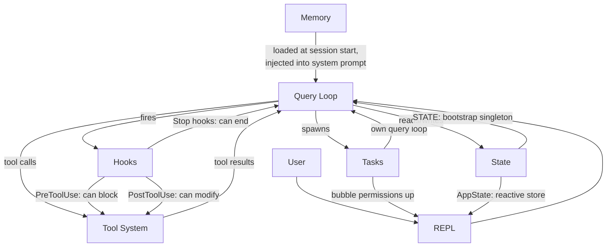

# Chapter 1: The Architecture of an AI Agent

## What You're Looking At

A traditional CLI is a function. It takes arguments, does work, and exits. `grep` does not decide to also run `sed`. `curl` does not open a file and patch it based on what it downloaded. The contract is simple: one command, one action, deterministic output.

An agentic CLI breaks every part of that contract. It takes a natural language prompt, decides what tools to use, executes them in whatever order the situation demands, evaluates the results, and loops until the task is done or the user stops it. The "program" is not a fixed sequence of instructions -- it is a loop around a language model that generates its own instruction sequence at runtime. The tool calls are the side effects. The model's reasoning is the control flow.

Claude Code is Anthropic's production implementation of this idea: a TypeScript monolith of nearly two thousand files that turns a terminal into a full development environment powered by Claude. It shipped to hundreds of thousands of developers, which means every architectural decision carries real-world consequences. This chapter gives you the mental model. Six abstractions define the entire system. A single data flow connects them. Once you internalize the golden path from keystroke to final output, every subsequent chapter is a zoom into one segment of that path.

What follows is a retrospective decomposition -- these six abstractions were not designed upfront on a whiteboard. They emerged from the pressures of shipping a production agent to a large user base. Understanding them as they are, not as they were planned, sets the right expectations for the rest of the book.

---

## The Six Key Abstractions

Claude Code is built on six core abstractions. Everything else -- the 400+ utility files, the forked terminal renderer, the vim emulation, the cost tracker -- exists to support these six.



Here is what each one does and why it exists.

**1. The Query Loop** (`query.ts`, ~1,700 lines). An async generator that is the heartbeat of the entire system. It streams a model response, collects tool calls, executes them, appends results to the message history, and loops. Every interaction -- REPL, SDK, sub-agent, headless `--print` -- flows through this single function. It yields `Message` objects that the UI consumes. Its return type is a discriminated union called `Terminal` that encodes exactly why the loop stopped: normal completion, user abort, token budget exhaustion, stop hook intervention, max turns, or unrecoverable error. The generator pattern -- rather than callbacks or event emitters -- gives natural backpressure, clean cancellation, and typed terminal states. Chapter 5 covers the loop's internals in full.

**2. The Tool System** (`Tool.ts`, `tools.ts`, `services/tools/`). A tool is anything the agent can do in the world: read a file, run a shell command, edit code, search the web. That simplicity of purpose hides significant machinery. Each tool implements a rich interface covering identity, schema, execution, permissions, and rendering. Tools are not just functions -- they carry their own permission logic, concurrency declarations, progress reporting, and UI rendering. The system partitions tool calls into concurrent and serial batches, and a streaming executor starts concurrency-safe tools before the model even finishes its response. Chapter 6 covers the full tool interface and execution pipeline.

**3. Tasks** (`Task.ts`, `tasks/`). Tasks are background work units -- primarily sub-agents. They follow a state machine: `pending -> running -> completed | failed | killed`. The `AgentTool` spawns a new `query()` generator with its own message history, tool set, and permission mode. Tasks give Claude Code its recursive capability: an agent can delegate to sub-agents, which can delegate further.

**4. State** (two layers). The system maintains state at two levels. A mutable singleton (`STATE`) holds ~80 fields of session-level infrastructure: working directory, model configuration, cost tracking, telemetry counters, session ID. It is set once at startup and mutated directly -- no reactivity. A minimal reactive store (34 lines, Zustand-shaped) drives the UI: messages, input mode, tool approvals, progress indicators. The separation is intentional: infrastructure state changes rarely and does not need to trigger re-renders; UI state changes constantly and must. Chapter 3 covers the two-tier architecture in depth.

**5. Memory** (`memdir/`). The agent's persistent context across sessions. Three tiers: project-level (`CLAUDE.md` files in the repo), user-level (`~/.claude/MEMORY.md`), and team-level (shared via symlinks). At session start, the system scans for all memory files, parses frontmatter, and an LLM selects which memories are relevant to the current conversation. Memory is how Claude Code "remembers" your codebase conventions, architectural decisions, and debugging history.

**6. Hooks** (`hooks/`, `utils/hooks/`). User-defined lifecycle interceptors that fire at 27 distinct events across 4 execution types: shell commands, single-shot LLM prompts, multi-turn agent conversations, and HTTP webhooks. Hooks can block tool execution, modify inputs, inject additional context, or short-circuit the entire query loop. The permission system itself is partially implemented through hooks -- `PreToolUse` hooks can deny tool calls before the interactive permission prompt ever fires.

---

## The Golden Path: From Keystroke to Output

Trace a single request through the system. The user types "add error handling to the login function" and presses Enter.



Three things to notice about this flow.

First, the query loop is a generator, not a callback chain. The REPL pulls messages from it via `for await`, which means backpressure is natural -- if the UI cannot keep up, the generator pauses. This is a deliberate choice over event emitters or observable streams.

Second, tool execution overlaps with model streaming. The `StreamingToolExecutor` does not wait for the model to finish before starting concurrency-safe tools. A `Read` call can complete and return its results while the model is still generating the rest of its response. This is speculative execution -- if the model's final output invalidates the tool call (rare but possible), the result is discarded.

Third, the entire loop is re-entrant. When the model makes tool calls, the results are appended to the message history, and the loop calls the model again with the updated context. There is no separate "tool result handling" phase -- it is all one loop. The model decides when it is done by simply not making any more tool calls.

---

## The Permission System

Claude Code runs arbitrary shell commands on your machine. It edits your files. It can spawn sub-processes, make network requests, and modify your git history. Without a permission system, this is a security catastrophe.

The system defines seven permission modes, ordered from most to least permissive:

| Mode | Behavior |
|------|----------|
| `bypassPermissions` | Everything allowed. No checks. Internal/testing only. |
| `dontAsk` | All allowed, but still logged. No user prompts. |
| `auto` | Transcript classifier (LLM) decides allow/deny. |
| `acceptEdits` | File edits auto-approved; all other mutations prompt. |
| `default` | Standard interactive mode. User approves each action. |
| `plan` | Read-only. All mutations blocked. |
| `bubble` | Escalate decision to parent agent (sub-agent mode). |

When a tool call needs permission, the resolution follows a strict chain:



The `auto` mode deserves special attention. It runs a separate, lightweight LLM call that classifies the tool invocation against the conversation transcript. The classifier sees a compact representation of the tool input and decides whether the action is consistent with what the user asked for. This is the mode that lets Claude Code work semi-autonomously -- approving routine operations while flagging anything that looks like it deviates from the user's intent.

Sub-agents default to `bubble` mode, which means they cannot approve their own dangerous actions. Permission requests propagate up to the parent agent or ultimately to the user. This prevents a sub-agent from silently running destructive commands that the user never saw.

---

## Multi-Provider Architecture

Claude Code talks to Claude through four different infrastructure paths, all transparent to the rest of the system.



The key insight is that the Anthropic SDK provides wrapper classes for each cloud provider that present the same interface as the direct API client. The `getAnthropicClient()` factory reads environment variables and configuration to determine which provider to use, constructs the appropriate client, and returns it. From that point forward, `callModel()` and every other consumer treats it as a generic Anthropic client.

Provider selection is determined at startup and stored in `STATE`. The query loop never checks which provider is active. This means switching from Direct API to Bedrock is a configuration change, not a code change -- the agent loop, tool system, and permission model are entirely provider-agnostic.

---

## The Build System

Claude Code ships as both an internal Anthropic tool and a public npm package. The same codebase serves both, with compile-time feature flags controlling what gets included.

```typescript
// Conditional imports guarded by feature flags
const reactiveCompact = feature('REACTIVE_COMPACT')
  ? require('./services/compact/reactiveCompact.js')
  : null
```

The `feature()` function comes from `bun:bundle`, Bun's built-in bundler API. At build time, each feature flag resolves to a boolean literal. The bundler's dead code elimination then strips the `require()` call entirely when the flag is false -- the module is never loaded, never included in the bundle, and never shipped.

The pattern is consistent: a top-level `feature()` guard wrapping a `require()` call. The `require()` is used instead of `import` specifically because dynamic `require()` can be fully eliminated by the bundler when the guard is false, while dynamic `import()` cannot (it returns a Promise that the bundler must preserve).

There is an irony worth noting. The source maps published with early npm releases contained `sourcesContent` -- the full original TypeScript source, including the internal-only code paths. The feature flags successfully stripped the runtime code but left the source in the maps. This is how the Claude Code source became publicly readable.

---

## How the Pieces Connect

The six abstractions form a dependency graph:



Memory feeds into the query loop as part of the system prompt. The query loop drives tool execution. Tool results feed back into the query loop as messages. Tasks are recursive query loops with isolated message histories. Hooks intercept the query loop at defined points. State is read and written by everything, with the reactive store bridging to the UI.

The circular dependency between the query loop and the tool system is the system's defining characteristic. The model generates tool calls. Tools execute and produce results. Results are appended to the message history. The model sees the results and decides what to do next. This cycle continues until the model stops generating tool calls or an external constraint (token budget, max turns, user abort) terminates it.

Here is how they connect to the chapters that follow: the golden path from input to output is the thread that runs through the entire book. Chapter 2 traces how the system boots to the point where this path can execute. Chapter 3 explains the two-tier state architecture that the path reads and writes. Chapter 4 covers the API layer that the query loop calls. Each subsequent chapter zooms into one segment of the path you have just seen end-to-end.

---

## Apply This

If you are building an agentic system -- any system where an LLM decides what actions to take at runtime -- here are the patterns from Claude Code's architecture that transfer.

**The generator loop pattern.** Use an async generator as your agent loop, not callbacks or event emitters. The generator gives you natural backpressure (consumers pull at their own pace), clean cancellation (`.return()` on the generator), and a typed return value for terminal states. The problem it solves: in callback-based agent loops, it is difficult to know when the loop is "done" and why. Generators make termination a first-class part of the type system.

**The self-describing tool interface.** Every tool should declare its own concurrency safety, permission requirements, and rendering behavior. Do not put this logic in a central orchestrator that "knows about" each tool. The problem it solves: a central orchestrator becomes a god object that must be updated every time a tool is added. Self-describing tools scale linearly -- adding tool N+1 requires zero changes to existing code.

**Separate infrastructure state from reactive state.** Not all state needs to trigger UI updates. Session configuration, cost tracking, and telemetry belong in a plain mutable object. Message history, progress indicators, and approval queues belong in a reactive store. The problem it solves: making everything reactive adds subscription overhead and complexity to state that changes once at startup and is read a thousand times. Two tiers match two access patterns.

**Permission modes, not permission checks.** Define a small set of named modes (plan, default, auto, bypass) and resolve every permission decision through the mode. Do not scatter `if (isAllowed)` checks through tool implementations. The problem it solves: inconsistent permission enforcement. When every tool goes through the same mode-based resolution chain, you can reason about the system's security posture by knowing which mode is active.

**Recursive agent architecture via tasks.** Sub-agents should be new instances of the same agent loop with their own message history, not special-cased code paths. Permission escalation flows upward via `bubble` mode. The problem it solves: sub-agent logic that diverges from the main agent loop, leading to subtle differences in behavior and error handling. If the sub-agent is the same loop, it inherits all the same guarantees.
